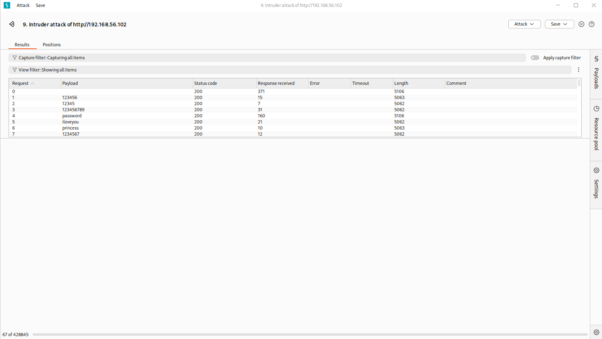

# Lab Writeup #04 — DVWA Brute Force Attack with Burp Suite Intruder

**Date:** 18/03/2026
**Target:** 192.168.56.102 (Ubuntu 24.04 — DVWA)
**Attacker:** 192.168.56.101 (Kali Linux)

## TL;DR
Installed DVWA on the Ubuntu target's Apache server. Used Burp Suite Intruder
to brute force the DVWA login form and successfully cracked the admin password
using the rockyou.txt wordlist.

## What is DVWA?
Damn Vulnerable Web Application is a deliberately insecure PHP/MySQL web app
designed for security practice. It runs on top of Apache and contains real
vulnerabilities including brute force, SQL injection, XSS and more.

## Tools Used
- Burp Suite Community Edition (proxy + Intruder)
- rockyou.txt wordlist (/usr/share/wordlists/rockyou.txt)
- Firefox with proxy set to 127.0.0.1:8080

## Attack Steps

### 1. Installed DVWA on Ubuntu target
sudo apt install apache2 php php-mysqli mariadb-server git -y
sudo git clone https://github.com/digininja/DVWA.git /var/www/html/DVWA
sudo chown -R www-data:www-data /var/www/html/DVWA/

### 2. Intercepted login request with Burp Suite
- Set Firefox proxy to 127.0.0.1:8080
- Navigated to http://192.168.56.102/DVWA/vulnerabilities/brute/
- Submitted login form — Burp caught the raw HTTP request
- Sent request to Intruder

### 3. Configured Intruder attack
- Set payload position on the password parameter
- Loaded /usr/share/wordlists/rockyou.txt as payload list
- Attack type: Sniper

### 4. Identified cracked password
- Most failed responses returned length: 5062
- One response returned length: 5106 — payload: "password"
- Longer response = welcome message returned instead of error message
- Confirmed: admin:password is valid

## Screenshot

## Why Length Difference Works
A failed login always returns the same error page — same size every time.
A successful login returns a welcome message with extra content — making the
response physically larger. Sorting by length instantly identifies the hit.

## Key Concepts Learned
- Burp Suite Intruder automates credential stuffing attacks
- Wordlists like rockyou.txt contain real leaked passwords
- Response length is used to identify successful logins
- The Community Edition is throttled — Pro version is faster

## MITRE ATT&CK
- T1110.001 — Brute Force: Password Guessing
- T1078 — Valid Accounts (using cracked credentials)

## Next Steps
- Try SQL injection on DVWA
- Set security to Medium and attempt same attack — observe the difference